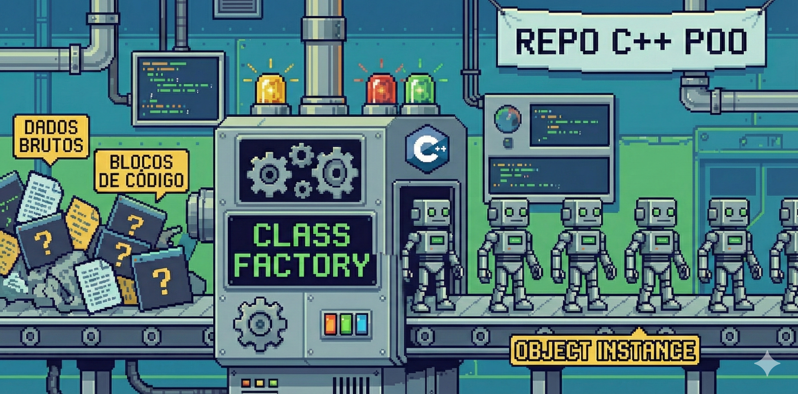

# 🏭 REPO POO C++ - 2025/2 - ENG.COMPUT 3




## 📚 SOBRE

Este é o universo da **Programação Orientada a Objetos (POO)** que construí durante o **3º semestre** do curso de **Engenharia de Computação no IFMS - Campus Três Lagoas**, com o auxílio do professor **José Roberto Campos**.

Aqui, deixo de lado a programação estruturada para mergulhar no **paradigma** da Programação Orientada a Objetos, modelando soluções mais próximas do mundo real.

As atividades avaliativas e exercícios práticos desenvolvidos ao longo da disciplina estão concentradas neste local. Os tópicos consolidados incluem:

* **Fundamentos:** Classes, Objetos, Atributos e Métodos.
* **Gerenciamento de Memória:** Construtores, Destrutores e Ponteiros.
* **Pilares de POO:**
  * Encapsulamento (Modificadores de acesso);
  * Herança (Simples e Múltipla);
  * Polimorfismo (Sobrescrita e Sobrecarga);
  * Abstração (Classes Abstratas e Interfaces).

---

## 💡 OBJETIVOS

Neste repositório, você encontra uma coleção de códigos, exercícios e projetos desenvolvidos (majoritariamente em **C++**), com foco em:

- 🏗️ Modelagem de sistemas complexos utilizando **Classes e Objetos**;
- 🧠 Desenvolvimento de um pensamento arquitetural de software, visando código reutilizável, modular e limpo;
- 🧱 Compreensão profunda dos quatro pilares de POO.

---

## 📂 ESTRUTURA

#### Listas Avaliativas

As listas de exercícios avaliativas estão organizadas tematicamente em pastas específicas para facilitar a navegação. Sendo assim, estão nomeadas da seguinte maneira: `ListaN_Conteudo`.

Os demais códigos são de estudos para avaliações, curiosidades minhas, projetos pessoais e exercícios feitos em sala de aula.

---

## ⚙️ COMO RODAR OS CÓDIGOS? (COMPILAÇÃO NO TERMINAL)

Aqui utilizaremos o compilador `g++` para os arquivos `.cpp`. Para facilitar projetos maiores, utilizamos também o `make`.

### Requisitos

- **G++** (Compilador GCC para C++);
- **Make** (Ferramenta de automação de compilação);
- **Terminal** do sistema operacional de sua escolha;
- **Git** (opcional, para clonar o repositório).

### Passo a passo

1. **Clone o repositório:**

```bash
git clone https://github.com/isamartins-engcomput/POO.git
```

2. **Navegue até a pasta do repositório:**

```bash
cd POO
```

Você tem duas opções, dependendo da estrutura da pasta em que você está...

#### Opção A: Compilação Manual (Para exercícios simples)

Se a pasta contiver apenas poucos arquivos `.cpp` e nenhum arquivo chamado `Makefile`, use o `g++` diretamente.

```bash
# Exemplo para um único arquivo:
g++ nome_arquivo.cpp -o nome_programa

# Exemplo para múltiplos arquivos:
g++ main.cpp ClasseA.cpp ClasseB.cpp -o sistema_completo
```

#### Opção B: Utilizando Makefile (Para projetos complexos)

Se você encontrar um arquivo chamado `Makefile` dentro da pasta do projeto, o processo é muito mais simples, pois a compilação já está automatizada.

Basta rodar os comandos:

```bash
# O terminal lerá as instruções do Makefile e gerará o executável automaticamente:
make

# Para limpar os arquivos de compilação (objetos .o e executáveis antigos), use:
make clean
```

> ⚠️ **Obs:** O uso do `make` é necessário/recomendado para as pastas `ComponenteEletronico_POO`, `codeAULA` e `BancoContas_POO`.

**Executando o programa:**
Após a compilação (seja manual ou via make), execute o arquivo gerado:

```bash
./nome_programa
```

---

## 🛠️ AMBIENTE DE DESENVOLVIMENTO

- **IDE/Editores**: Visual Studio Code (com extensões C/C++) e Editor de Texto do Ubuntu;
- **Compiladores**: G++ (versão 13.3.0 ou superior) e [OnlineGDB](https://www.onlinegdb.com);
- **Sistema operacional**: Linux Ubuntu 24.04.2 LTS.

---

## 👩🏽‍💻 AUTORIA

**Isadora de Souza Martins**
Estudante de Engenharia de Computação

- GitHub: [isamartins-engcomput](https://github.com/isamartins-engcomput)
- LinkedIn: [Isadora Martins](https://www.linkedin.com/in/isadora-martins-611478332)
- E-mail pessoal: isadoramartins1906@gmail.com
- E-mail institucional: isadora.martins2@estudante.ifms.edu.br

---

> ✨ Obrigada por conferir meu trabalho! Este repositório representa um salto importante na minha jornada como desenvolvedora, passando da lógica estruturada para a arquitetura de objetos. Fique à vontade para explorar e dar feedbacks! :)
